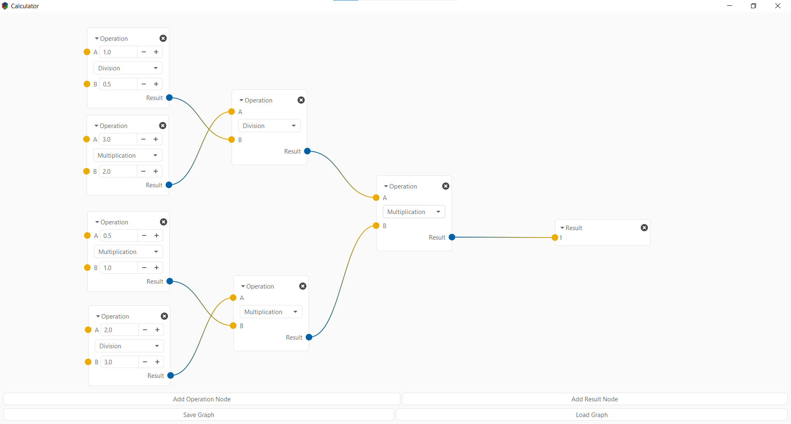

# Gtk.NodeGraph

Provide a widget, to create and edit a node graph using [GtkSharp](https://github.com/GtkSharp/GtkSharp).
This project was primarily a C# port of the [gtknodes] project, a GTK+ library in C.
Some types and functionalities as been modified or added to match a better C# workflow.

## Features

Gtk.NodeGraph provides you these functionalities:

- Creation of simples to complex flow graphs, using a very simple API.
- Event based node data reception and emission.
- Automatic node socket compatibility check during flow graph creation (eg. A node socket which output an integer can't be connected to a node which receive string)
- Save your graphs to XML files, formatted like GtkBuildable files, to allow any GTK developers (even those who don't know GtkSharp) to consult/edit them.
- Load your previously saved graphs from XML files.

## Samples

There are some samples to showcase the Gtk.NodeGraph library:

### Calculator

A simple calculator application using these nodes: 

- [BinaryOperationNode](https://github.com/AliensGroup/Gtk.NodeGraph/blob/master/Samples/Calculator/Nodes/BinaryOperationNode.cs):
Process an operation between two input values and out put the result.
- [ResultNode](https://github.com/AliensGroup/Gtk.NodeGraph/blob/master/Samples/Calculator/Nodes/ResultNode.cs):
Just show the result of an operation.

## TODO

- [ ] Publish package to Nuget

## License

This project is uses the same license as the original project ([gtknodes]), which is **GNU Lesser General Public License (LGPL)**.

[gtknodes]: https://github.com/aluntzer/gtknodes